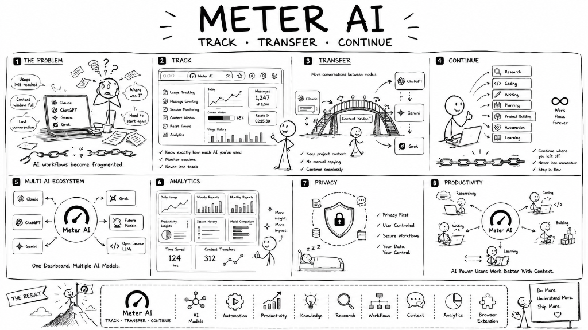

# Meter AI

Meter AI is a browser extension and companion web service built for people who use Claude heavily. It gives you the usage information that Claude's own interface withholds — live session tracking, reset countdowns, quota estimation, and conversation transfer to other AI providers — without sending any of your conversation data to a server.



---

## What it does

Claude imposes session and weekly limits on how many messages you can send, but it does not surface useful numbers while you are actually working. You find out you have run out only when you are stopped mid-conversation.

Meter AI solves this by reading Claude's own page data locally in your browser and turning it into something usable: a live usage bar, a countdown to your next reset, an estimate of messages remaining, and a summary of your usage history over the past seven days.

When you do hit a limit, the Context Bridge feature copies your current conversation and opens it directly in ChatGPT, Gemini, or Grok so you can keep working without manually copying anything.

---

## Features

### Usage Tracking

A lightweight status bar appears below Claude's prompt input and updates automatically on every message you send. It shows session percentage used, estimated messages remaining (calculated per model — Sonnet and Opus have different limits), and a live countdown to your reset time.

### Weekly Quota Estimation

Meter tracks usage across rolling seven-day periods so you can see how much of your weekly budget remains. This is especially useful for Claude Pro and Team accounts where weekly limits apply at the model level.

### Context Bridge

When you reach a rate limit, you can transfer your conversation to another provider in a single click. Meter formats the conversation as a structured prompt and opens it in whichever alternative you choose — ChatGPT, Google Gemini, or Grok — without any manual copy and paste.

### Usage History

Local session logs record prompt counts, model usage, and active time. This builds into a dashboard showing usage trends across days and weeks, all stored entirely in your browser.

### AI Wrapped

An annual summary view shows your total prompt volume, working hours, most active models, and estimated subscription value used across the year.

### Privacy-first Architecture

Everything that touches your conversations and session data stays on your device. The extension reads Claude's page data in the browser sandbox — no content is transmitted to Meter's servers. The only network requests the extension makes are optional Pro license checks, which send an account identifier, not conversation data.

### Google Account Synchronization

Pro subscribers can sign in with Google to verify their license and sync their plan status across devices. Sign-in is optional for the free tier and is used only to verify entitlement, not to collect usage data.

### Premium Membership

Two paid tiers are available, both processed through Razorpay and priced in INR.

**Pro Monthly** — unlocks unlimited Context Bridge handoffs, the full analytics dashboard, and cross-device profile sync for 169 rupees per month. This is a one-time monthly charge with no automatic renewal unless explicitly set up.

**Pro Lifetime** — a single payment of 1,999 rupees for permanent access to all Pro features, including all future updates.

Free users get real-time session tracking, reset countdowns, local storage, and two daily Context Bridge transfers at no cost.

### Lightweight Performance

The extension has no build step, no bundler, and no frontend framework. It is plain JavaScript with a small set of Node.js packages on the backend. Page weight is minimal and the extension does not affect Claude's performance in any measurable way.

---

## Why Meter AI is different

Most productivity tools for AI workflows try to do too much. They add layers, require accounts, and collect data to justify their own infrastructure.

Meter AI does one thing: it gives you information your primary tool should already be showing you, and it does that locally, privately, and without asking you to trust it with anything sensitive.

The free tier is genuinely useful. The Pro tier exists for people who hit the Context Bridge limit regularly or want historical analytics. Neither tier involves conversation data leaving your machine.

The codebase is built to be auditable. There is no obfuscation, no minification, and no external analytics SDK. The logic for reading session data runs entirely in the browser content script. The server handles only license verification, payment processing, and feedback form submission.

---

## Technology

- **Extension:** Plain JavaScript content scripts, background service worker, and a popup panel
- **Website & Backend:** Node.js with Express serving both static files and the REST API
- **Database:** Supabase (PostgreSQL) with Row Level Security for profile and subscription storage
- **Authentication:** Supabase Auth with Google OAuth
- **Payments:** Razorpay subscription and order APIs with HMAC-SHA256 webhook verification
- **Email:** Resend API for feedback form delivery

---

## Project structure

```
meter-ai-website/
├── index.html          Landing page markup
├── styles.css          All page styles and responsive breakpoints
├── script.js           Client-side logic: auth, payments, UI interactions
├── server.js           Express API server: profile, upgrade, webhook, feedback routes
├── schema.sql          Database schema and trigger definitions for Supabase
├── apply-schema.js     One-time migration utility for initial database setup
├── robots.txt          Search engine directives
├── sitemap.xml         URL sitemap for crawlers
└── assets/             Static image assets
```

---

## License

Source code is provided for reference. All rights reserved. The Meter AI name, brand, and software are proprietary.

---

*Built by [Harsha Parisha](https://harshaparisha.in)*
